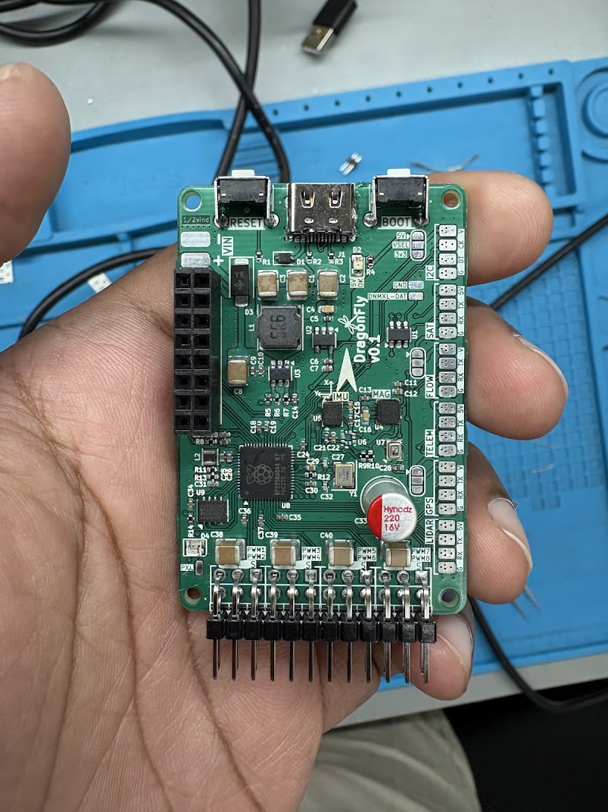

# DragonFly Flight Controller

DragonFly is an open hardware flight-controller PCB project. This repository contains the KiCad design files and production fabrication package.

## Repository contents

- `KiCad/Source/` — editable V0.1 board, hierarchical schematic sheets, and project settings.
- `KiCad/Production/` — PCB and project settings for the released `withRibs` manufacturing revision used to generate the production Gerbers.
- `Manufacturing/Gerbers/` — production Gerber layers, drill files, drill maps, and KiCad job file.
- `Photos/` — photo of the assembled PCB.

## Fabrication

Send all files in `Manufacturing/Gerbers/` to your PCB fabricator as one fabrication package. The set includes front and back copper, solder mask, silkscreen, paste, board outline, plated and non-plated drill files, drill maps, and the Gerber job file. Confirm your fabricator accepts these Gerber formats and review the generated previews before ordering.

The released board includes an external rib frame (`withRibs`) for fabrication. Use the matching board in `KiCad/Production/` when reviewing this manufacturing package. `KiCad/Source/` retains the editable source project from the main V0.1 design directory.

## Opening the design

Open `KiCad/Source/dragonfly_v0_1.kicad_pro` in KiCad to work with the source design. Open `KiCad/Production/Dragonfly_v0-1_Ribs.kicad_pcb` to inspect the exact released manufacturing board.

## Revision notes

The production files are from the V0.1 `withRibs` release. The original release notes describe it as adding an external rib frame for improved fabrication. Review electrical design, clearances, and fabrication outputs independently before manufacturing or flight use.

